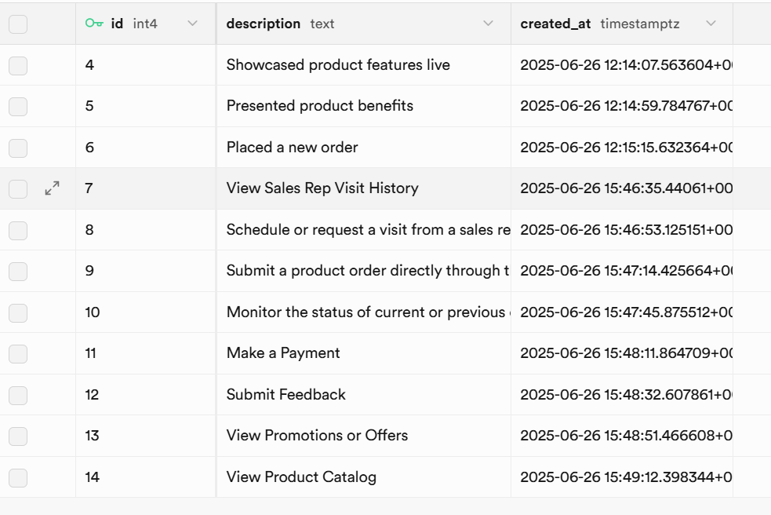

# Visit Tracker Flutter App

## Overview
This Flutter application allows users to track customer visits, view visit statistics, and manage visit data in a visually appealing and responsive interface. The app is built with clean architecture, Riverpod for state management, and integrates with Supabase as the backend.

## Screenshots
> **Add your screenshots here**
- 
- 
- 
- 
- 
- 
- 
- 
- 

## Key Architectural Choices
- **Riverpod for State Management:** Ensures modular, testable, and maintainable state across the app.
- **Repository Pattern:** Abstracts data access, making it easy to swap or mock data sources.
- **Supabase Backend:** Provides scalable, real-time backend with authentication and database.
- **Responsive UI:** All screens adapt to mobile and desktop layouts.
- **Separation of Concerns:** UI, business logic, and data layers are clearly separated for maintainability.

## Setup Instructions
1. **Clone the repository:**
   ```sh
   git clone <your-repo-url>
   cd tracker_feature
   ```
2. **Install dependencies:**
   ```sh
   flutter pub get
   ```
3. **Configure Supabase:**
   - Update `lib/supabase_client.dart` with your Supabase URL and anon key if needed.
4. **Run the app:**
   ```sh
   flutter run
   ```
   - For web: `flutter run -d chrome`
   - For desktop: `flutter run -d windows` (or macos/linux)

## Notes
- **Offline Support:** Not implemented. The app requires an internet connection to fetch and update data from Supabase.
- **Testing:** Basic widget tests are included in the `test/` directory. Add more tests for business logic and providers as needed.
- **CI/CD:** Not set up, but the project structure supports easy integration with GitHub Actions or other CI tools.

## Assumptions, Trade-offs, and Limitations
- Assumes Supabase tables (`visits`, `customers`, `activities`) are set up as expected.
- No offline caching or local persistence is implemented.
- Error handling is basic; production apps should add more robust error and retry logic.
- The UI is optimized for modern devices and may require tweaks for legacy or very small screens.

---

For questions or contributions, please open an issue or pull request!
